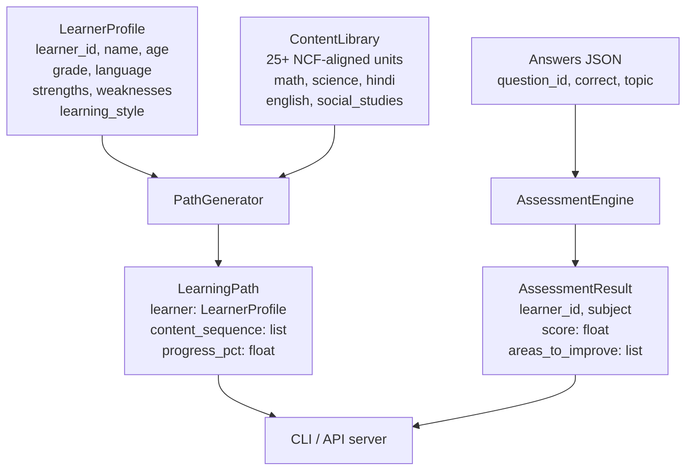

# aumai-edumentor

**Personalised learning AI for India, aligned with the National Curriculum Framework 2023.**

Part of the [AumAI](https://github.com/aumai) open source suite for agentic AI infrastructure.

[](https://github.com/aumai/aumai-edumentor/actions)
[](https://pypi.org/project/aumai-edumentor/)
[](LICENSE)
[](https://python.org)

> **Educational Disclaimer:** This tool is an educational aid. Always verify recommendations
> with qualified educators and follow local curriculum guidelines. This tool does not replace
> professional pedagogical assessment.

---

## What is this?

Think of aumai-edumentor as a knowledgeable teaching assistant who knows every student's
strengths, weaknesses, preferred learning style, and grade level — and uses that knowledge
to decide exactly which lesson to give next, in exactly the right format, at exactly the
right difficulty.

In a typical Indian classroom, one teacher might serve 40 or more students, all with
different needs. Edumentor does not replace that teacher. Instead it handles the
personalisation problem that no single teacher can solve at scale: generating a unique
ordered sequence of content for each learner, covering the subjects, difficulty levels, and
content formats that will move that learner forward most efficiently.

---

## Why does this matter? (First principles)

A student who already understands fractions gains nothing from spending another hour on
fraction basics. A student who struggles with algebra will fall further behind if pushed
straight into quadratic equations. Learning is most efficient when the next task sits just
beyond what the learner already knows — what psychologist Lev Vygotsky called the *zone of
proximal development*.

At scale, personalisation is a combinatorial problem. Five subjects, three difficulty
levels, four content types, and twelve grade levels produce hundreds of possible content
combinations. Deciding which combination is right for a specific learner, every session,
without a digital system is practically impossible in under-resourced schools.

aumai-edumentor solves this by encoding:

- India-specific curriculum context (NCF 2023 competency codes)
- A built-in content library with real pedagogical rationale across five subjects
- A path-generation algorithm that ranks content by learner grade, weakness profile, and
  learning style preference

The result is a deterministic, transparent, explainable personalisation engine that any
school, NGO, or edtech platform can run locally without an LLM subscription.

---

## Architecture



---

## Features

- **NCF 2023 alignment** — every built-in content unit carries one or more NCF competency
  codes (e.g. `NCF-MATH-G5-FRA-1`), enabling curriculum traceability and reporting.
- **25 built-in content units** covering mathematics, science, Hindi, English, and social
  studies across grades 1 through 10.
- **Four content types** — `text` (explanations), `quiz` (JSON-structured questions),
  `activity` (hands-on tasks), each matched to appropriate learning styles.
- **Learning style routing** — visual and kinesthetic learners are routed to `activity`
  content first; auditory and read-write learners to `text` content first.
- **Weakness-aware difficulty** — a learner whose weaknesses include the requested subject
  starts at `beginner` difficulty; others start at `intermediate`.
- **Grade-range filtering** — content is filtered to the learner's grade ± 1 for
  appropriate challenge without overwhelming difficulty jumps.
- **Assessment engine** — evaluates a list of learner answers (with robust handling of
  string vs boolean `correct` flags) and returns a scored `AssessmentResult` with specific
  topics that need improvement.
- **Extensible library** — add custom `LearningContent` objects at runtime without
  touching built-in data.
- **Full CLI** — `path`, `assess`, `subjects`, and `serve` commands.
- **Type-safe** — full Pydantic v2 validation on all inputs and outputs.

---

## Quick Start

### Prerequisites

- Python 3.11 or higher
- `pip install aumai-edumentor`

### CLI usage

**List available subjects:**

```bash
aumai-edumentor subjects
```

Output:

```
AVAILABLE SUBJECTS:
  - english (3 content units)
  - hindi (3 content units)
  - math (10 content units)
  - science (6 content units)
  - social_studies (3 content units)
```

**Generate a personalised learning path:**

Create a learner profile file `learner.json`:

```json
{
  "learner_id": "student-001",
  "name": "Priya",
  "age": 12,
  "grade": 7,
  "language": "en",
  "strengths": ["science"],
  "weaknesses": ["math"],
  "learning_style": "visual"
}
```

```bash
aumai-edumentor path --learner learner.json --subject math
```

**Run an assessment:**

Create an answers file `answers.json`:

```json
[
  {"question_id": "q1", "correct": true,  "topic": "Fractions"},
  {"question_id": "q2", "correct": false, "topic": "Fractions"},
  {"question_id": "q3", "correct": false, "topic": "Algebra Introduction"}
]
```

```bash
aumai-edumentor assess --learner-id student-001 --subject math --answers answers.json
```

**Start the API server:**

```bash
aumai-edumentor serve --host 0.0.0.0 --port 8000
```

### Python API

```python
from aumai_edumentor.models import LearnerProfile
from aumai_edumentor.core import PathGenerator, AssessmentEngine

# Build a learner profile
learner = LearnerProfile(
    learner_id="student-001",
    name="Priya",
    age=12,
    grade=7,
    strengths=["science"],
    weaknesses=["math"],
    learning_style="visual",
)

# Generate a personalised path
generator = PathGenerator()
path = generator.generate(learner, subject="math")

print(f"Path for {path.learner.name}: {len(path.content_sequence)} units")
for unit in path.content_sequence:
    print(f"  [{unit.difficulty}] {unit.topic} ({unit.content_type})")

# Evaluate an assessment
engine = AssessmentEngine()
answers = [
    {"question_id": "q1", "correct": True,  "topic": "Fractions"},
    {"question_id": "q2", "correct": False, "topic": "Algebra Introduction"},
]
result = engine.evaluate("student-001", "math", answers)
print(f"Score: {result.score}% | Improve: {result.areas_to_improve}")
```

---

## CLI Reference

All commands are accessed via the `aumai-edumentor` entry point.

### `subjects`

Lists all subjects in the built-in content library with unit counts.

```
aumai-edumentor subjects
```

No options. Output is a plain list.

---

### `path`

Generates a personalised learning path for one learner and one subject.

```
aumai-edumentor path --learner <FILE> --subject <SUBJECT>
```

| Option | Required | Description |
|--------|----------|-------------|
| `--learner` | Yes | Path to a JSON file containing a `LearnerProfile` object |
| `--subject` | Yes | Subject name: `math`, `science`, `hindi`, `english`, `social_studies` |

Output includes the ordered content sequence with difficulty labels, content types, NCF
alignment codes, and a 150-character content preview per unit.

---

### `assess`

Evaluates a set of learner answers and prints a scored assessment result.

```
aumai-edumentor assess --learner-id <ID> --subject <SUBJECT> --answers <FILE>
```

| Option | Required | Description |
|--------|----------|-------------|
| `--learner-id` | Yes | String identifier for the learner |
| `--subject` | Yes | Subject being assessed |
| `--answers` | Yes | Path to a JSON file containing a list of answer objects |

Each answer object in the JSON file requires:

| Field | Type | Description |
|-------|------|-------------|
| `question_id` | `string` | Arbitrary question identifier |
| `correct` | `bool` or `string` | Whether the answer was correct |
| `topic` | `string` | Topic the question tests |

Performance labels: `Excellent` (score >= 80%), `Good` (>= 60%), `Needs Improvement` (< 60%).

---

### `serve`

Starts a FastAPI/uvicorn server exposing the EduMentor HTTP API.

```
aumai-edumentor serve [--host HOST] [--port PORT]
```

| Option | Default | Description |
|--------|---------|-------------|
| `--host` | `127.0.0.1` | Network interface to bind |
| `--port` | `8000` | Port number |

Requires `uvicorn` to be installed: `pip install uvicorn`. The educational disclaimer is
printed to stdout on startup.

---

## Python API Examples

### Adding custom content to the library

```python
from aumai_edumentor.core import ContentLibrary, PathGenerator
from aumai_edumentor.models import LearnerProfile, LearningContent

library = ContentLibrary()

custom_unit = LearningContent(
    content_id="math-custom-001",
    subject="math",
    topic="Profit and Loss",
    difficulty="intermediate",
    content_type="activity",
    content=(
        "Calculate profit and loss for a small shop. "
        "Given cost price and selling price, find profit percentage."
    ),
    ncf_alignment=["NCF-MATH-G6-ARI-1"],
    grade_level=6,
)
library.add(custom_unit)

generator = PathGenerator(library=library)
learner = LearnerProfile(
    learner_id="s2",
    name="Ravi",
    age=11,
    grade=6,
    learning_style="kinesthetic",
)
path = generator.generate(learner, "math")
print(f"Custom path has {len(path.content_sequence)} units")
```

### Searching the content library directly

```python
from aumai_edumentor.core import ContentLibrary

library = ContentLibrary()

# All math content at grade 5
grade5_math = library.search("math", grade=5)
print([c.topic for c in grade5_math])

# Only beginner-level science
beginner_science = library.search("science", difficulty="beginner")

# All content, all subjects
all_units = library.all_content()
print(f"Total units: {len(all_units)}")

# Subject names
print(library.all_subjects())
# ['english', 'hindi', 'math', 'science', 'social_studies']
```

### Interpreting an AssessmentResult

```python
from aumai_edumentor.core import AssessmentEngine

engine = AssessmentEngine()

# Mixed performance
answers = [
    {"question_id": "q1", "correct": True,  "topic": "Counting"},
    {"question_id": "q2", "correct": False, "topic": "Subtraction"},
    {"question_id": "q3", "correct": False, "topic": "Subtraction"},
    {"question_id": "q4", "correct": True,  "topic": "Addition"},
]
result = engine.evaluate("learner-42", "math", answers)
# result.score == 50.0
# result.areas_to_improve == ["Subtraction"]

# Empty answers — handled gracefully
empty_result = engine.evaluate("learner-42", "math", [])
# empty_result.score == 0.0
# empty_result.areas_to_improve == ["No answers provided — please attempt the assessment."]
```

---

## Configuration

aumai-edumentor has no external configuration file. All behaviour is controlled through:

1. **`LearnerProfile` fields** — `grade`, `weaknesses`, and `learning_style` are the three
   fields that most directly influence which content appears in the generated path and in
   what order.
2. **`ContentLibrary` instance** — pass a pre-populated `ContentLibrary` to `PathGenerator`
   to use custom or augmented content sets.
3. **CLI flags** — all runtime options are passed as command-line arguments; no environment
   variables are required.

### LearnerProfile field reference

| Field | Type | Default | Valid values |
|-------|------|---------|--------------|
| `learner_id` | `str` | required | any string |
| `name` | `str` | required | any string |
| `age` | `int` | required | 4–25 |
| `grade` | `int` | required | 1–12 |
| `language` | `str` | `"en"` | any IETF language code |
| `strengths` | `list[str]` | `[]` | subject names |
| `weaknesses` | `list[str]` | `[]` | subject names |
| `learning_style` | `str` | `"visual"` | `visual`, `auditory`, `kinesthetic`, `read-write` |

---

## Technical Deep-Dive

### Path generation algorithm

`PathGenerator.generate` runs five sequential steps:

1. **Subject filter** — retrieve all `LearningContent` objects whose `subject` matches the
   requested subject (case-insensitive comparison).
2. **Grade-range filter** — keep only content where `grade_level` falls in
   `range(max(1, learner.grade - 1), min(12, learner.grade + 2))`. If this range yields
   no content, falls back to all subject content.
3. **Starting difficulty selection** — if the requested subject appears (case-insensitive)
   in `learner.weaknesses`, the starting difficulty is `beginner`; otherwise it is
   `intermediate`.
4. **Sort** — content is sorted by a two-key tuple:
   `(abs(content_difficulty_value - target_difficulty_value), grade_level)`. Content
   closest to the target difficulty appears first; ties are broken by grade level ascending.
5. **Learning-style partition** — content matching the learner's preferred content type
   (visual/kinesthetic maps to `activity`; auditory/read-write maps to `text`) is
   placed before other types. Deduplication by `content_id` is enforced.

Difficulty integer values: `beginner=0`, `intermediate=1`, `advanced=2`.

### Assessment correctness handling

`AssessmentEngine.evaluate` guards against a documented Python edge case: JSON
deserialisation may produce the string `"false"` instead of the boolean `False`. Calling
`bool("false")` in Python evaluates to `True` because any non-empty string is truthy,
which would incorrectly count wrong answers as correct.

The internal `_is_correct` helper treats the strings `"false"`, `"0"`, `"no"`, and `""`
as falsy; all other values are cast to `bool`.

### NCF 2023 alignment codes

Every built-in content unit carries at least one NCF competency code in the format:

```
NCF-<SUBJECT>-G<GRADE>-<DOMAIN>-<INDEX>
```

Examples: `NCF-MATH-G5-FRA-1`, `NCF-SCI-G7-PHY-1`, `NCF-HINDI-G8-WRITE-1`.

These codes are stored in `LearningContent.ncf_alignment` and surfaced in CLI output and
API responses to support curriculum audit and compliance reporting.

---

## Integration with Other AumAI Projects

| Project | Integration point |
|---------|-------------------|
| **aumai-specs** | Use aumai-specs to validate `LearnerProfile` JSON at API boundaries before passing to `PathGenerator` |
| **aumai-nyayasetu** | In school-access rights scenarios, cross-reference the Right to Education (FR-05) for learners denied school admission |

---

## Installation

```bash
pip install aumai-edumentor
```

Development install:

```bash
git clone https://github.com/aumai/aumai-edumentor
cd aumai-edumentor
pip install -e ".[dev]"
pytest
```

---

## License

Apache 2.0. See [LICENSE](LICENSE).

## Part of AumAI

This project is part of [AumAI](https://github.com/aumai) — open source infrastructure for
the agentic AI era.
